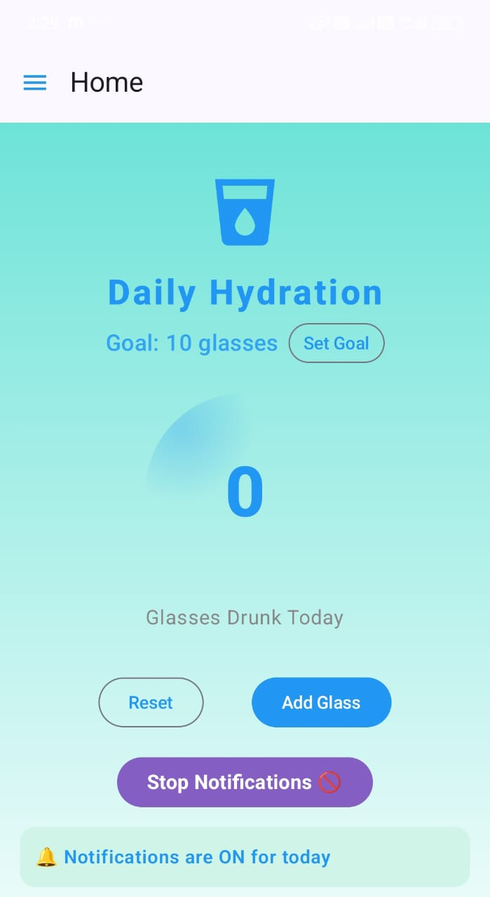

# Hydration Buddy

Hydration Buddy is a modern Android app that helps you stay healthy by sending hourly reminders to drink water until you reach your daily goal.

## Features

- Hourly hydration reminders (7am–11pm)
- Set your own daily water intake goal
- Track daily, yesterday's, and monthly water intake
- Pause notifications for the day after reaching your goal
- Beautiful, colorful Material 3 UI
- FAQ, Privacy Policy, and Contact screens
- All data stays on your device (privacy-friendly)

## Screenshots

Add screenshots to the `screenshots/` folder and reference them here:

```


```

## Getting Started

1. **Clone this repo:**
   ```sh
   git clone https://github.com/yourusername/HydrationBuddy.git
   ```
2. **Open in Android Studio.**
3. **Build and run on your device or emulator.**

## Folder Structure

```
HydrationBuddy/
├── app/                # Android app source code
├── gradle/             # Gradle wrapper files
├── screenshots/        # App screenshots for documentation
├── .gitignore
├── README.md
├── LICENSE
├── CONTRIBUTING.md
├── build.gradle(.kts)
├── settings.gradle(.kts)
├── gradlew
├── gradlew.bat
```

## Contributing

See [CONTRIBUTING.md](CONTRIBUTING.md) for guidelines.

## License

This project is licensed under the MIT License - see the [LICENSE](LICENSE) file for details.

---

**Developed by Momin Jan**